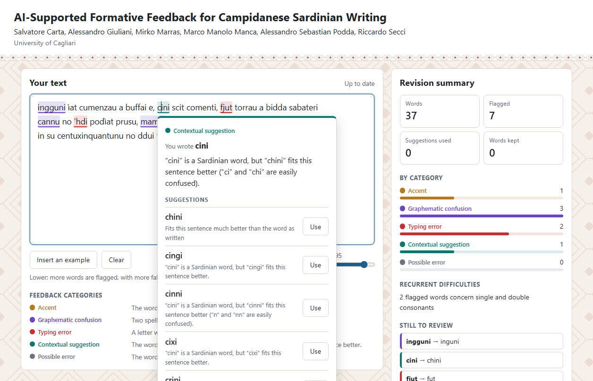

# AI-Supported Formative Feedback for Campidanese Sardinian Writing

Salvatore Carta, Alessandro Giuliani, Mirko Marras, Marco Manolo Manca, Alessandro Sebastian Podda, Riccardo Secci (University of Cagliari)

This repository contains the writing environment presented at the SIREM 2026 conference "Engaging Education" (Rome, 19–21 November 2026), together with everything needed to rebuild it: data preparation, model training, evaluation and the application itself.

Campidanese Sardinian has no dedicated spellchecker. This project provides one, but treats it as a formative feedback tool rather than an automatic corrector. The writer sees which words may be wrong, why, and which alternatives fit the sentence, and decides what to do with each of them.



## What the environment does

- **Feedback while writing.** Text is analysed as it is typed. Words that may be wrong are underlined, with a different colour for each feedback category. The word still being typed is left alone until the writer moves on.
- **An explanation for each flagged word.** Clicking a word opens a card that says what kind of issue it is and why the word was flagged.
- **Alternatives to compare, not automatic replacement.** The card lists up to five suggestions, each with a note on how it relates to the sentence. The writer can use one, or keep the word as written.
- **Doubtful words without a suggestion.** When a word looks unusual but no suggestion is available, it is still pointed out, as an invitation to check it.
- **A revision summary.** A side panel shows how many words were flagged, how many suggestions were used, how many words were kept, and which difficulties keep coming back. "Finish revision" shows the final summary, with the words involved in each difficulty.

### Feedback categories

| Category | When it applies | Example |
|---|---|---|
| Accent | The word and the suggestion differ only in their accent | *intendiu* → *inténdiu* |
| Graphematic confusion | Two spellings that stand for similar sounds have been mixed up | *castedu* → *casteddu* |
| Typing error | A letter was swapped, added, left out or mistyped | *cnu* → *cun* |
| Contextual suggestion | The word exists, or shows no obvious slip, but another word fits the sentence better | *cini* → *chini* |
| Possible error | The word looks unusual in the sentence, but no suggestion is available | |

Explanations are built from fixed templates, so the same slip always receives the same explanation. All the texts shown to the writer are in [src/feedback/messages.py](src/feedback/messages.py).

## How it works

The environment combines linguistic rules with two language models.

1. **A language model for Sardinian.** An Italian BERT model is further trained on a Campidanese corpus, so that it learns which words are plausible in a Sardinian sentence.
2. **Synthetic errors.** Confusion rules derived from the graphematic repertoire of the Sardinian language, together with keyboard slips and missing accents, are used to corrupt correct sentences.
3. **An error detector.** A second model is trained on the corrupted sentences to recognise, in context, the words that are probably misspelled.
4. **Suggestions.** For each flagged word, candidates are looked up in Sardinian dictionaries among the words one edit away, and the language model ranks them by how well they fit the sentence.
5. **Feedback.** The same rules used to create the errors are used to explain them: each pair of flagged word and suggestion is assigned a category and an explanation.

The detector is deliberately cautious. In a writing-support tool, false alarms on correct words undermine the writer's trust, so the system is tuned to favour precision over recall.

## Results

The evaluation uses 160 held-out sentences in which 409 spelling errors were injected automatically. These sentences were not used for training or for tuning the system.

| What is measured | Result |
|---|---|
| Detection: precision / recall / F0.5 | 0.964 / 0.785 / 0.922 |
| Automatic correction: precision / recall / F0.5 | 0.799 / 0.562 / 0.737 |
| Errors flagged with suggestions | 69.2% |
| Right word first / in the first 3 / in the first 5 suggestions | 56.2% / 64.1% / 66.0% |
| Agreement between feedback category and type of injected error | 88.5% |
| Correct words flagged | 12 out of 3,080 (5 of them with a suggestion) |
| Word error rate: corrupted text → after correction | 0.117 → 0.053 |

When an error is flagged, the right word is among the first five suggestions in 95% of cases (270 out of 283).

By type of injected error:

| Error type | Injected | Detected | Right word first | Right word in the first 5 |
|---|---|---|---|---|
| Graphematic confusion | 214 | 78.5% | 57.0% | 65.0% |
| Typing error | 166 | 79.5% | 59.0% | 68.7% |
| Missing accent | 29 | 72.4% | 34.5% | 58.6% |

### Limitations

- The errors are synthetic and produced by the same rules used in training. They are not errors made by real writers, so these figures say how well the system recovers known kinds of slips, not how it performs in a classroom.
- The test set is small, and accent errors are few (29): figures for that category are indicative.
- About 8% of the words in the test sentences are missing from the dictionaries. When the right word is unknown, it cannot be suggested.
- When a slip produces another valid word (*ci* for *chi*), it is harder to detect.
- The environment has not yet been evaluated with learners and teachers.

## Getting started

Requirements: Python 3.12 and an NVIDIA GPU with 8 GB of memory. The project was developed and tested on Windows 11 with an RTX 4070; it has not been tested without a GPU.

```powershell
git clone <repository-url>
cd sardinian-formative-feedback
python -m venv .venv
.\.venv\Scripts\Activate.ps1
pip install -r requirements.txt
```

On Linux or macOS, activate the environment with `source .venv/bin/activate`. `requirements.txt` installs PyTorch for CUDA 12.6: for a different CUDA version, change the index URL and the version tag at the top of that file.

The trained models are not stored in the repository. Before the first launch, train them as described in the next section (about ten minutes).

### Running the environment

```powershell
python -m src.app
```

Then open `http://127.0.0.1:8000` in a browser. Everything runs on the local computer.

"Finish revision" saves a record of the session (the text, the feedback events and the summary) as a JSON file in the `sessions` folder. The folder stays on the local computer and is not versioned. Before using the environment with learners, make sure they know that their text is saved.

## Reproducing the results

All commands are run from the project root. Each step uses the output of the previous one. Random seeds are fixed, so repeated evaluations give identical figures.

| Step | Command | Time on the test machine |
|---|---|---|
| 1. Train the Sardinian language model | `python -m src.modeling.pretrain_mlm` | about 5 minutes |
| 2. Train the error detector | `python -m src.modeling.finetune_detector` | about 4 minutes |
| 3. Tune the thresholds on the validation set | `python -m src.evaluation.tune_thresholds` | about 45 minutes |
| 4. Evaluate on the test set | `python -m src.evaluation.evaluate` | a few seconds |

Step 3 can be skipped: the thresholds used for the published results are already stored in `runs/pipeline_params.json`. Results, plots and sentence-level predictions are written to the `runs` folder.

The prepared data is included in the repository. To rebuild it from the raw corpus:

```powershell
python -m src.data_prep.clean_dataset
python -m src.data_prep.split_corpus
python -m src.data_prep.build_dictionaries corpus
```

Other useful commands:

```powershell
# Correct a sentence from the command line
python -m src.pipeline.correct "su trenu 'e casteddu arribàda a msesudì"

# See how the error generator corrupts a sentence
python -m src.data_prep.synth_errors "su trenu 'e casteddu arribàda a mesudì"

# Run the tests of the feedback engine
python -m unittest discover tests
```

## Repository structure

```
├── data/
│   ├── datasets/        Raw and cleaned Campidanese corpus
│   ├── dictionaries/    Sardinian word lists
│   └── training/        Train, validation and test sentences
├── docs/                Images used in this document
├── models/              Trained models (created by the training scripts, not versioned)
├── runs/                Results, plots, tuned thresholds and predictions
├── sessions/            Records of writing sessions (created by the application, not versioned)
├── src/
│   ├── config.py        Paths, seeds and default settings
│   ├── rules.py         Graphematic confusion rules and keyboard layout
│   ├── data_prep/       Corpus cleaning, splitting, dictionaries, synthetic errors
│   ├── modeling/        Training of the language model and of the error detector
│   ├── pipeline/        Detection, suggestion and ranking
│   ├── feedback/        Feedback categories, explanations and interface texts
│   ├── evaluation/      Threshold tuning and evaluation
│   └── app/             Web application (server and page)
├── tests/               Tests of the feedback engine
└── repertorio_grafematico_sardo.pdf
```

## Data and resources

- **Corpus.** 3,170 Campidanese sentences taken from the novel *Po cantu Biddanoa* by Benvenuto Lobina (first published in 1987; Ilisso, 2004), which is written in Sardinian with an Italian translation on the facing page. The sentences are split into 2,709 training lines, 304 validation sentences and 160 test sentences.
- **Dictionaries.** Standard and non-standard Campidanese lemmas from [sardu.wiki](https://sardu.wiki/) (Acadèmia de su Sardu) and the vocabulary of the training corpus: about 19,000 words in total. Two larger word lists, from [Ditzionariu in línia](https://ditzionariu.nor-web.eu/) and from the Sardinian Wikipedia, are included but not used for suggestions, because they mix all Sardinian varieties.
- **Graphematic rules.** Derived from the *Repertorio grafematico sperimentale per la certificazione della lingua sarda* (Regione Autònoma de Sardigna, annex to Delib.G.R. n. 18/13 of 10 June 2022), included in this repository.
- **Base model.** [dbmdz/bert-base-italian-uncased](https://huggingface.co/dbmdz/bert-base-italian-uncased).

## Citation

Carta, S., Giuliani, A., Marras, M., Manca, M. M., Podda, A. S., & Secci, R. (2026). AI-Supported Formative Feedback for Campidanese Sardinian Writing. *Journal of Inclusive Methodology and Technology in Learning and Teaching*. Manuscript submitted for publication.
